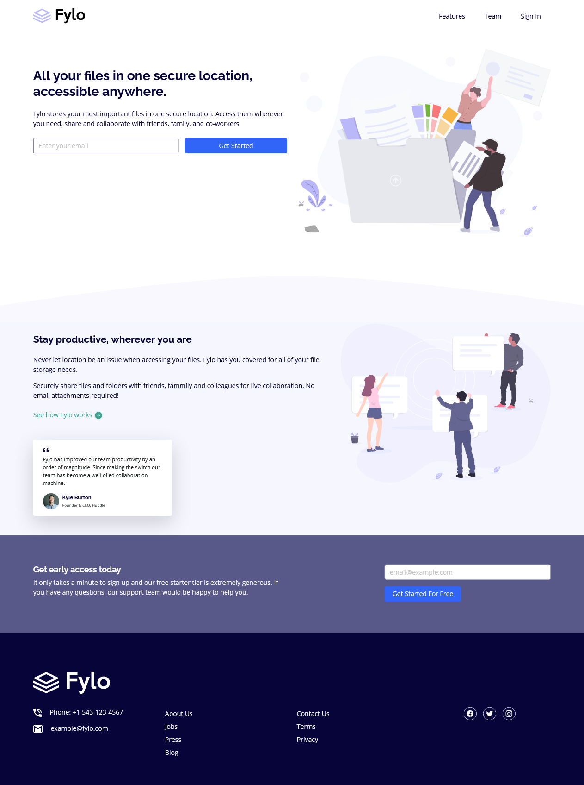

# Frontend Mentor - Fylo landing page with two column layout solution

This is a solution to the [Fylo landing page with two column layout challenge on Frontend Mentor](https://www.frontendmentor.io/challenges/fylo-landing-page-with-two-column-layout-5ca5ef041e82137ec91a50f5). Frontend Mentor challenges help you improve your coding skills by building realistic projects.

## Table of contents

- [Overview](#overview)
  - [The challenge](#the-challenge)
  - [Screenshot](#screenshot)
  - [Links](#links)
- [My process](#my-process)
  - [Built with](#built-with)
- [Author](#author)

## Overview

### The challenge

Users should be able to:

- View the optimal layout for the site depending on their device's screen size
- See hover states for all interactive elements on the page

### Screenshot

### Links

- Solution URL: [Frontend Mentor](https://www.frontendmentor.io/solutions/fylo-landing-page-with-two-column-layout-bootstrap-5-KdDstEeoF)
- Live Site URL: [GH Pages](https://jsamuelap.github.io/fylo-landing-page/)

## My process

### Built with

- Semantic HTML5 markup
- Sass custom properties
- Mobile-first workflow
- [Bootstrap 5](https://getbootstrap.com/) - CSS framework

## Author

- Website - [JSamuel portfolio](https://jsamuelap.github.io/)
- GitHub - [JSamuelAP](https://github.com/JSamuelAP)
- Frontend Mentor - [@JSamuelAP](https://www.frontendmentor.io/profile/JSamuelAP)
- Twitter - [@JSamuelAP](https://twitter.com/JSamuelAP)
